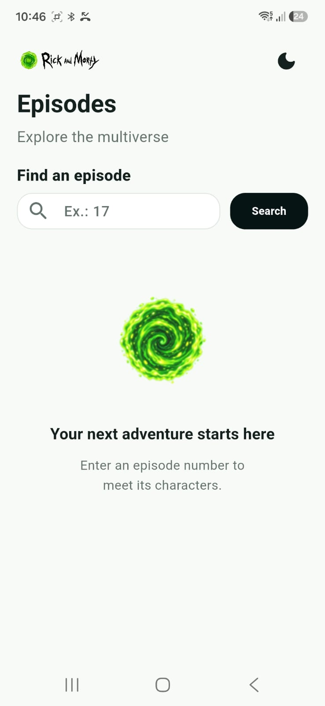
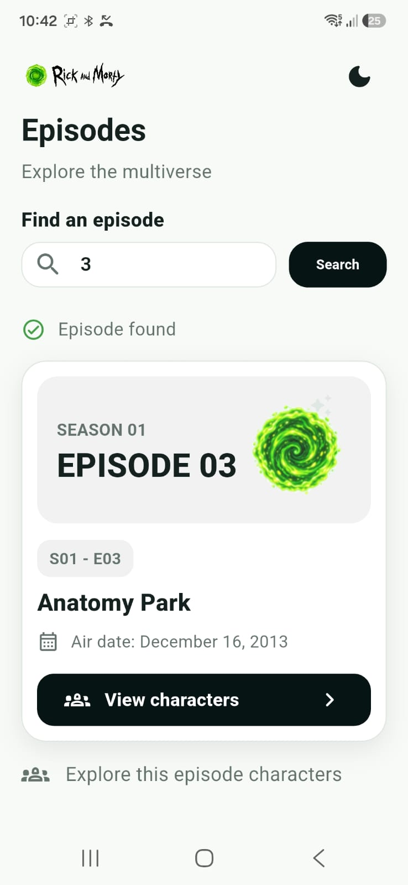
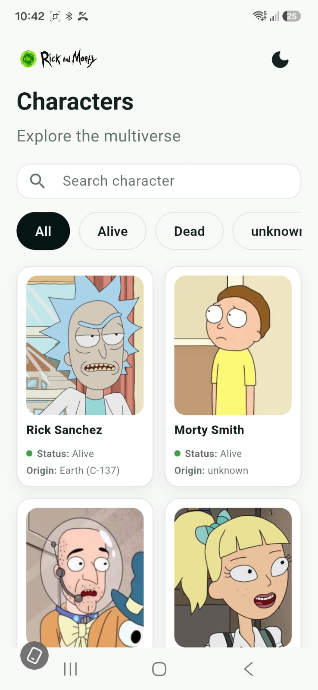
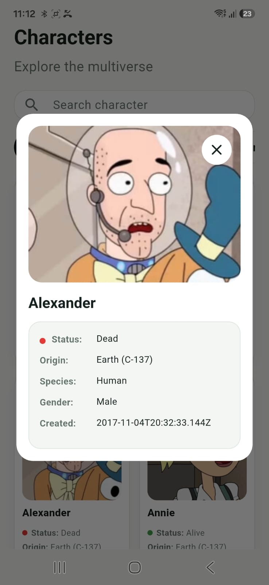
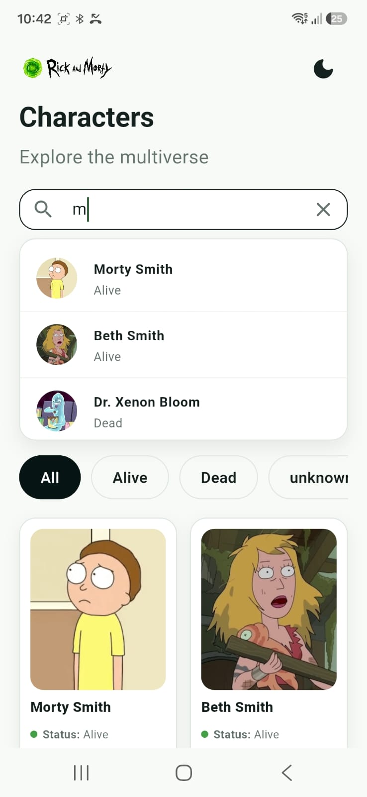
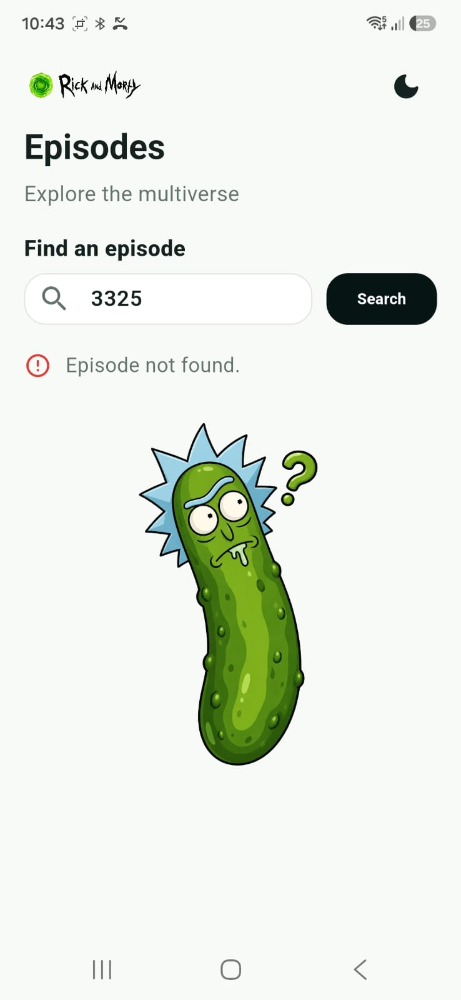

# Mortyverse

Aplicativo Flutter para consultar episódios de **Rick and Morty** e visualizar os personagens de cada episódio usando uma API Node.js local.

## Funcionalidades

* Busca de episódio por ID.
* Tela de personagens do episódio encontrado.
* Filtro de personagens por nome e status.
* Popup com detalhes do personagem.
* Suporte a tema claro e escuro.
* Splash screen e launcher icon configurados.
* Teste de interface e teste real da API.

## Requisitos

* Flutter SDK configurado.
* API Node.js rodando na porta `3000`.
* Celular/emulador com acesso ao endereço da API.

## Instalação

```bash
flutter pub get
```

## Configuração da API

O app usa `API_BASE_URL` para apontar para a API:

```dart
const String.fromEnvironment('API_BASE_URL')
```

O valor padrão atual está em:

```txt
http://192.168.68.101:3000
```

Para rodar em um celular físico, use o IP real do Wi-Fi do computador onde a API está rodando:

```bash
flutter run --dart-define=API_BASE_URL=http://SEU_IP_WIFI:3000
```

Para emulador Android:

```bash
flutter run --dart-define=API_BASE_URL=http://10.0.2.2:3000
```

Para desktop local:

```bash
flutter run --dart-define=API_BASE_URL=http://localhost:3000
```

No VS Code, também existem perfis prontos em `.vscode/launch.json`:

* `Mortyverse - Physical phone`
* `Mortyverse - Android emulator`
* `Mortyverse - Desktop local API`

## Executar

```bash
flutter run
```

Se estiver usando celular físico, confirme que:

* O celular e o PC estão na mesma rede Wi-Fi.
* A API Node.js está rodando.
* O firewall do Windows permite conexões na porta `3000`.

## Testes

Rodar todos os testes:

```bash
flutter test
```

Rodar apenas o teste de interface:

```bash
flutter test test/widget_test.dart
```

Rodar apenas o teste real da API:

```bash
flutter test test/episode_service_api_test.dart
```

O teste real da API depende do backend estar rodando e acessível. Se a API estiver desligada ou sem internet para consultar `rickandmortyapi.com`, esse teste pode falhar mesmo que o app esteja compilando corretamente.

## Gerar ícones e splash

Launcher icon:

```bash
dart run flutter_launcher_icons
```

Splash screen:

```bash
dart run flutter_native_splash:create
```

## Estrutura principal

```txt
lib/
├── models/
├── screens/
│   ├── home/
│   └── characters/
├── services/
├── theme/
└── widgets/
```

## API esperada

```http
GET /episode/:id
```

O retorno esperado contém:

* `id`
* `name`
* `air_date`
* `episode`
* `characters`

Cada personagem deve conter:

* `name`
* `status`
* `species`
* `gender`
* `origin`
* `image`
* `created`

## Screenshots

<table align="center">
  <tr>
    <td align="center">
      <br>
      <b>Home</b>
    </td>
    <td align="center">
      <br>
      <b>Episode Details</b>
    </td>
    <td align="center">
      <br>
      <b>Characters</b>
    </td>
  </tr>
</table>

<table align="center">
  <tr>
    <td align="center">
      <br>
      <b>Character Details</b>
    </td>
    <td align="center">
      <br>
      <b>Character Search</b>
    </td>
    <td align="center">
      <br>
      <b>Bad Request</b>
    </td>
  </tr>
</table>

---
> As imagens do aplicativo estão disponíveis em `assets/screens/`.